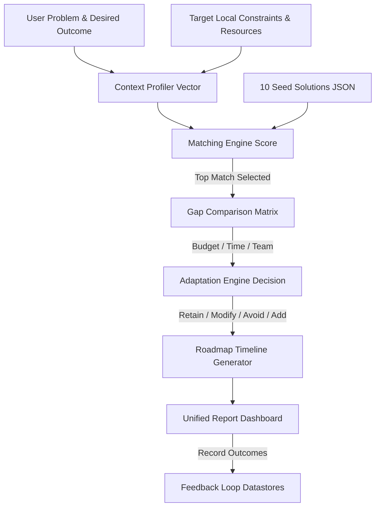

# Context-Aware Adaptation of Proven Solutions

> **Developed by Team V'ECTOR**
> *"Proven There → Adapted for Here"*  
> Academic Mini-Project Demonstration Platform

Many real-world problems already have successful templates or solutions. However, a solution that worked in one community, organization, or cohort cannot always be copied directly into another due to critical differences in local contexts (budgets, timelines, scale, available volunteers, infrastructure, etc.). 

This decision-support web application helps users input their problems and target constraints, automatically matches them against a seeded database of 10 proven case studies, performs an in-depth severity gap analysis, and generates a tailored adaptation strategy alongside a phased timeline roadmap.

---

## Technical Stack & Architecture

- **Frontend**: React.js (Vite), Tailwind CSS (v4 + PostCSS), Lucide React (Icons), Axios
- **Backend**: Node.js, Express.js, Dotenv
- **Database**: Local JSON-based dataset (structured for easy transition to PostgreSQL)
- **AI Service**: Google Gemini Pro Integration (`gemini-1.5-flash`) with dynamic rule-based local fallback

### Application Structure & File Tree
```
context-adaptation/
├── client/                      # React + Vite Frontend
│   ├── src/
│   │   ├── services/
│   │   │   └── api.js           # API endpoints caller
│   │   ├── App.jsx              # Main wizard & results workflow template
│   │   ├── App.css
│   │   ├── index.css            # Custom styling & typography
│   │   └── main.jsx
│   ├── index.html               # Main index with SEO meta tags
│   ├── package.json
│   ├── postcss.config.js
│   ├── tailwind.config.js
│   └── vite.config.js
├── server/                      # Express Backend
│   ├── data/
│   │   ├── solutions.json       # Seed database (10 detailed cases)
│   │   └── feedback.json        # Saved outcome log databases
│   ├── services/
│   │   ├── matchingEngine.js    # Problem and context matching logic
│   │   ├── contextComparison.js # Scale/budget gap calculator
│   │   ├── adaptationEngine.js  # Heuristic Retain/Modify/Avoid/Add decisions
│   │   ├── actionPlanGenerator.js # Roadmap timeline scheduler
│   │   └── aiService.js         # Gemini API handler
│   ├── server.js                # Express REST API routes
│   ├── package.json
│   └── test-demo.js             # Local verification test script
├── .env.example                 # Environmental variables configuration
└── README.md                    # System documentation
```

---

## Logical Workflow Pipeline



1. **Problem Formulation**: Users define the domain, title, description, and outcomes.
2. **Context Profiler**: Translates budgets, volunteers, weeks available, infrastructure facilities, and lists of constraints into a context vector.
3. **Scored Solution Retrieval**: Scans database using heuristic factors: Domain Relevance (20%), Problem overlap (40%), Goal alignment (20%), and Context compatibility (20%).
4. **Severity Gap Matrix**: Computes numerical offsets (e.g. "75% lower budget") and assigns Low/Medium/High severity badges.
5. **Adaptation formulation**: Classifies details into:
   - **Retain**: Core success factors (e.g. peer influence mechanisms).
   - **Modify**: Scaling operations (e.g. event frequencies, cohort sizes).
   - **Avoid**: Cutting cash-drain elements (e.g. catering, speakers' travel).
   - **Add**: Integrates low-cost items (e.g. digital tracking, Zoom calls).
6. **Action Plan Timeline**: Schedules tasks into Setup, Operational, and Evaluation phases.
7. **Feedback Outcomes**: Allows logging implementation findings to store new evidence.

---

## Setup and Installation

### Prerequisites
- [Node.js](https://nodejs.org/) (v16+ recommended)
- npm (Node Package Manager)

### Step 1: Clone and Configure Environment
Copy `.env.example` to `.env` inside the root workspace directory or the `server` directory:
```bash
cp .env.example .env
```
Inside `.env`, configure the optional Gemini API key:
```env
PORT=5000
GEMINI_API_KEY=your_gemini_api_key_here
```
*Note: If no API key is specified, the application will automatically fall back to the rules engines, keeping all features fully functional.*

### Step 2: Install Server Dependencies and Run Tests
Navigate to the `server/` directory, install packages, and execute the heuristics test script:
```bash
# In server directory
npm install
node test-demo.js
```
The test should return: `ALL HEURISTIC TESTS PASSED SUCCESS` showing correct matching scores and gap calculations for the demo.

### Step 3: Run the Express Backend Server
Start the Express server on port 5000:
```bash
# In server directory
npm start
```

### Step 4: Install Client Dependencies and Run Frontend
Open a **new terminal**, navigate to the `client/` directory, install packages, and start the Vite dev server:
```bash
# In client directory
npm install
npm run dev
```
Open your browser and navigate to `http://localhost:5173`.

---

## Demo Walkthrough Scenario

To verify the platform for your college demonstration, run the following scenario:

1. Click **"Load Demo Scenario"** on the landing page or the wizard step. It will autofill these inputs:
   - **Problem Title**: Low student participation in entrepreneurship activities
   - **Description**: Students are not showing interest in our entrepreneurial seminars and workshops...
   - **Domain**: Education
   - **Scale (Target population)**: 5,000 students
   - **Budget**: ₹50,000 *(Original Case: ₹2,00,000)*
   - **Team Size**: 10 volunteers *(Original Case: 20 ambassadors)*
   - **Time Window**: 2 months *(Original Case: 6 months)*
   - **Infrastructure**: Existing classrooms *(Original Case: Dedicated incubator facilities)*
   - **Constraints**: low budget, limited volunteers, limited mentors
2. Confirm the **Context Profile Vector** review page and click **"Run Analysis Pipeline"**.
3. **Verification of Results**:
   - **Match**: Matched Case is *Student Ambassador Engagement Program* with a **Prototype Match Score of 86%**.
   - **Gaps Matrix**: Budget is flagged as **HIGH severity (75% lower)**, Duration is **HIGH severity (67% less)**, and Facilities is **MEDIUM severity**.
   - **Adaptation Decisions**:
     - *Retain*: Student ambassador model.
     - *Modify*: 20 ambassadors &rarr; 1 ambassador per department; Weekly workshops &rarr; Biweekly sessions.
     - *Avoid*: High-cost physical guest events.
     - *Add*: Online mentor sessions; Digital participation tracking.
   - **Roadmap**: Generates a 3-phase timeline matching the 2 months constraint (Week 1 Setup, Weeks 2-6 Engagement, Weeks 7-8 Evaluation).
4. **Output Print/Export**: Click **"Export MD"** to generate a local markdown report file or **"Print Report"** to open the browser print dialog.

---

## System Limitations & Future Scope

### Limitations
- **Local Storage**: The database uses a local JSON repository. Under high concurrent edits, JSON writes may hit file locks.
- **Rules Mapping**: Heuristic adaptation mappings are preset inside the code rules. Unusual context combinations might yield generic recommendations.

### Future Scope
- **PostgreSQL Database Integration**: Swap the local JSON engine for PostgreSQL tables utilizing Sequelize or Prisma ORM.
- **Vector Embeddings Retrieval**: Transition keyword matching to semantic embeddings (using Gemini vector search or Pinecone) to match complex problem descriptions.
- **Multi-tenant Accounts**: Allow different student bodies or departments to save and compare multiple adapted campaigns concurrently.
